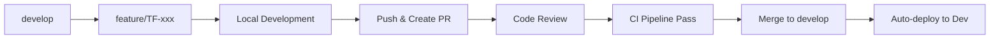
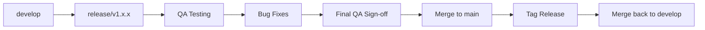
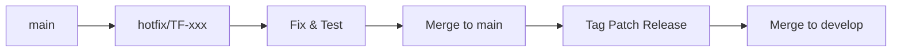

# TaskForge MVP Development Plan

**Analysis Date:** January 30, 2026  
**Document Version:** 1.0

---

## Executive Summary

TaskForge is a project management application built with:
- **Backend:** .NET 8 with Clean Architecture (API, Application, Domain, Infrastructure layers)
- **Frontend:** Angular 21 with standalone components, signals, and Tailwind CSS
- **Database:** SQL Server with Entity Framework Core + Identity

### Current MVP Readiness

| Area | Completion | Status |
|------|------------|--------|
| Backend Infrastructure | 95% | ✅ Solid foundation |
| Authentication System | 100% | ✅ Complete |
| Project Management | 95% | ✅ Working |
| Team Management | 50% | ⚠️ Service done, API empty |
| Task Management | 0% | ❌ Not started |
| Frontend Core | 95% | ✅ Well structured |
| Frontend Auth | 100% | ✅ Complete |
| Frontend Projects | 90% | ✅ Working |
| Frontend Tasks | 0% | ❌ Not started |
| Dashboard | 40% | ⚠️ Layout only |
| **Overall MVP** | **~55%** | ⚠️ Major feature missing |

---

## Current Implementation Status

### ✅ What's Complete

#### Backend
- **Authentication:** Registration, login, JWT tokens, refresh tokens, logout
- **Projects API:** Full CRUD with pagination, filtering, sorting, soft delete
- **Team Service:** All business logic implemented (not exposed via API)
- **Infrastructure:** EF Core, Identity, migrations, exception handling, logging

#### Frontend
- **Auth Pages:** Login and registration with validation
- **Projects Feature:** List, create, edit, delete with team management
- **Navigation:** Role-based menus, responsive layout
- **Core Services:** Auth, Projects, Teams fully integrated with API

#### Database Schema
- Users (ASP.NET Identity)
- Roles (Admin, ProjectManager, TeamMember)
- Projects (with soft delete, audit fields)
- Teams (1:1 with Projects)
- TeamMembers (join table with roles)

---

### ❌ What's Missing for MVP

#### Critical (Blocking MVP)

1. **Task Management** - Core feature not implemented
   - No Task entity/table
   - No Task DTOs, Service, Controller
   - No frontend task components

2. **TeamsController** - File exists but completely empty
   - Team service is fully implemented
   - No API endpoints exposed

#### Important (Should have for MVP)

3. **Dashboard Statistics** - Shows placeholders only
4. **Toast/Notification Service** - No user feedback after actions
5. **Profile Page** - Referenced but not implemented
6. **User Search** - Team member add requires typing email

#### Nice to Have (Post-MVP)

7. **Admin User Management**
8. **Comments on Tasks**
9. **File Attachments**
10. **Email Notifications**
11. **Activity Logs**

---

## Detailed Work Breakdown

### Phase 1: Critical Backend Fixes (Effort: 2-3 days)

#### 1.1 Implement TeamsController Endpoints
**File:** `src/TaskForge.API/Controllers/TeamsController.cs`

| Endpoint | Method | Priority |
|----------|--------|----------|
| `/api/teams/{id}` | GET | High |
| `/api/teams/project/{projectId}` | GET | High |
| `/api/teams/{id}` | PUT | Medium |
| `/api/teams/{id}/members` | GET | High |
| `/api/teams/{id}/members` | POST | High |
| `/api/teams/{id}/members/{memberId}` | PUT | Medium |
| `/api/teams/{id}/members/{memberId}` | DELETE | Medium |

**Effort:** 4-6 hours (service already complete)

#### 1.2 Create Task Entity & Infrastructure
**New/Modified Files:**

| File | Type | Description |
|------|------|-------------|
| `TaskForge.Domain/Entities/TaskItem.cs` | Create | Task entity with all properties |
| `TaskForge.Domain/Enums/TaskStatus.cs` | Create | Open, InProgress, Review, Done |
| `TaskForge.Domain/Enums/TaskPriority.cs` | Create | Low, Medium, High, Critical |
| `TaskForge.Infrastructure/Persistence/Configurations/TaskConfiguration.cs` | Create | EF Core configuration |
| `TaskForge.Infrastructure/Persistence/ApplicationDbContext.cs` | Modify | Add DbSet<TaskItem> |
| Migration | Create | Add Tasks table |

**Task Entity Properties:**
```
- Id (Guid)
- Title (string, required)
- Description (string, optional)
- Status (enum)
- Priority (enum)
- DueDate (DateTime, optional)
- ProjectId (Guid, FK)
- AssignedToId (Guid, FK to User)
- CreatedAt, UpdatedAt, CreatedBy, UpdatedBy (audit)
- IsDeleted (soft delete)
```

**Effort:** 4-6 hours

#### 1.3 Create Task Application Layer
**New Files:**

| File | Description |
|------|-------------|
| `TaskForge.Application/DTOs/Tasks/TaskDto.cs` | Response DTO |
| `TaskForge.Application/DTOs/Tasks/CreateTaskRequest.cs` | Create request |
| `TaskForge.Application/DTOs/Tasks/UpdateTaskRequest.cs` | Update request |
| `TaskForge.Application/DTOs/Tasks/TaskQueryParameters.cs` | Filter/page params |
| `TaskForge.Application/Interfaces/ITaskService.cs` | Service interface |
| `TaskForge.Application/Features/Tasks/TaskValidator.cs` | FluentValidation |

**Effort:** 4-6 hours

#### 1.4 Create Task Infrastructure & API
**New Files:**

| File | Description |
|------|-------------|
| `TaskForge.Infrastructure/Services/TaskService.cs` | Service implementation |
| `TaskForge.API/Controllers/TasksController.cs` | API endpoints |

**Endpoints:**
- `GET /api/projects/{projectId}/tasks` - List tasks (paginated, filtered)
- `GET /api/tasks/{id}` - Get task by ID
- `POST /api/projects/{projectId}/tasks` - Create task
- `PUT /api/tasks/{id}` - Update task
- `DELETE /api/tasks/{id}` - Soft delete task
- `PUT /api/tasks/{id}/status` - Quick status update
- `PUT /api/tasks/{id}/assign` - Assign to user

**Effort:** 8-10 hours

---

### Phase 2: Frontend Task Feature (Effort: 3-4 days)

#### 2.1 Task Models & Service
**New Files:**

| File | Description |
|------|-------------|
| `client/src/app/core/models/task.model.ts` | Task interfaces & enums |
| `client/src/app/core/services/task.service.ts` | Task API service |

**Effort:** 2-3 hours

#### 2.2 Task List Component
**New Files:**

| File | Description |
|------|-------------|
| `client/src/app/features/tasks/tasks.routes.ts` | Task routing |
| `client/src/app/features/tasks/task-list/task-list.component.ts` | Task list with filters |
| `client/src/app/features/tasks/task-list/task-list.component.html` | Template |

**Features:**
- Kanban board view (optional) or table view
- Filter by status, priority, assignee
- Quick status change
- Link to project

**Effort:** 8-12 hours

#### 2.3 Task Form Component
**New Files:**

| File | Description |
|------|-------------|
| `client/src/app/features/tasks/task-form/task-form.component.ts` | Create/edit form |
| `client/src/app/features/tasks/task-form/task-form.component.html` | Template |

**Features:**
- Title, description, status, priority, due date
- Assignee selection (team members)
- Validation

**Effort:** 6-8 hours

#### 2.4 Task Detail Component
**New Files:**

| File | Description |
|------|-------------|
| `client/src/app/features/tasks/task-detail/task-detail.component.ts` | Task view/actions |
| `client/src/app/features/tasks/task-detail/task-detail.component.html` | Template |

**Features:**
- Full task details
- Edit/delete actions
- Status change
- Assignment

**Effort:** 4-6 hours

#### 2.5 Integrate Tasks into Projects
**Modified Files:**

| File | Changes |
|------|---------|
| `client/src/app/features/projects/project-detail/project-detail.component.ts` | Add tasks tab |
| `client/src/app/app.routes.ts` | Add task routes |

**Effort:** 3-4 hours

---

### Phase 3: Dashboard & Polish (Effort: 2-3 days)

#### 3.1 Dashboard Statistics API
**New/Modified Files:**

| File | Description |
|------|-------------|
| `TaskForge.Application/DTOs/Dashboard/DashboardStatsDto.cs` | Stats response |
| `TaskForge.Application/Interfaces/IDashboardService.cs` | Interface |
| `TaskForge.Infrastructure/Services/DashboardService.cs` | Implementation |
| `TaskForge.API/Controllers/DashboardController.cs` | API endpoint |

**Stats to include:**
- Total projects (user has access to)
- Active tasks (assigned to user)
- Team members count
- Tasks due soon

**Effort:** 4-6 hours

#### 3.2 Wire Dashboard Frontend
**Modified Files:**

| File | Changes |
|------|---------|
| `client/src/app/core/services/dashboard.service.ts` | Create service |
| `client/src/app/features/dashboard/dashboard.component.ts` | Fetch & display stats |

**Effort:** 3-4 hours

#### 3.3 Toast Notification Service
**New Files:**

| File | Description |
|------|-------------|
| `client/src/app/core/services/toast.service.ts` | Toast management |
| `client/src/app/shared/components/toast/toast.component.ts` | Toast display |

**Features:**
- Success/error/warning/info types
- Auto-dismiss
- Position configuration

**Effort:** 4-6 hours

#### 3.4 Confirmation Modal
**New Files:**

| File | Description |
|------|-------------|
| `client/src/app/shared/components/confirm-modal/confirm-modal.component.ts` | Reusable modal |

**Usage:** Delete operations, logout, unsaved changes

**Effort:** 2-3 hours

---

### Phase 4: Testing & Bug Fixes (Effort: 2-3 days)

#### 4.1 Backend Unit Tests
**New Files:**

| File | Description |
|------|-------------|
| `TaskForge.Tests/` project | Test project |
| Service tests | Test all services |
| Controller tests | Integration tests |

**Effort:** 8-12 hours

#### 4.2 Frontend Testing
- Component unit tests
- Service tests
- E2E critical flows

**Effort:** 8-12 hours

#### 4.3 Bug Fixes & Polish
- Error handling edge cases
- Loading states consistency
- Form validation messages
- Responsive design fixes

**Effort:** 8-12 hours

---

## Effort Summary

| Phase | Description | Estimated Effort |
|-------|-------------|------------------|
| **Phase 1** | Backend Tasks + Teams API | 2-3 days |
| **Phase 2** | Frontend Tasks Feature | 3-4 days |
| **Phase 3** | Dashboard & Polish | 2-3 days |
| **Phase 4** | Testing & Bug Fixes | 2-3 days |
| **Total** | **MVP Completion** | **9-13 working days** |

---

## Technical Debt & Recommendations

### Current Issues to Address

1. **TeamsController is empty** - Service fully implemented but no endpoints
2. **No test projects** - Add unit and integration tests
3. **Hardcoded strings** - Consider resource files for messages
4. **No caching** - Consider adding response caching for lists

### Architecture Recommendations

1. **Keep current Clean Architecture** - Well implemented
2. **Continue using signals** - Modern Angular approach
3. **Add CQRS later** - For complex queries (post-MVP)
4. **Consider SignalR** - For real-time updates (post-MVP)

### Security Checklist

- [x] JWT authentication
- [x] Refresh tokens
- [x] Password requirements
- [x] Account lockout
- [x] Authorization on endpoints
- [ ] Rate limiting
- [ ] Input sanitization review
- [ ] CORS production configuration

---

## Deployment Considerations

### Backend
- Configure production appsettings
- Set up proper CORS origins
- Configure proper logging (file/cloud)
- Set up database migration strategy
- Consider containerization (Docker)

### Frontend
- Configure production environment.ts
- Set up proper API base URL
- Enable production optimizations
- Consider CDN for static assets

### Database
- Run migrations on deployment
- Set up backup strategy
- Consider read replicas for scaling

---

## Priority Order for Development

### Week 1: Core Backend + Basic Tasks ✅ COMPLETED (January 30, 2026)
1. ✅ Fix TeamsController (expose existing service)
2. ✅ Create Task entity, migration, DTOs
3. ✅ Implement TaskService and TasksController
4. ✅ Create frontend task models and service

**Phase 1 Deliverables:**
- TeamsController with 7 endpoints
- TaskItem entity with Status/Priority enums
- TaskService with full CRUD + filtering/sorting
- TasksController with 10 endpoints
- Database migration for Tasks table

### Week 2: Frontend Tasks + Dashboard ✅ COMPLETED (January 30, 2026)
5. ✅ Task list component with filters (my-tasks.component.ts)
6. ✅ Task form (create/edit) (task-form.component.ts)
7. ✅ Task detail view (task-detail.component.ts)
8. ✅ Integrate tasks into projects (project-detail.component.ts updated)
9. ✅ Wire dashboard statistics (dashboard.component.ts updated)

**Phase 2 Deliverables:**
- Task models and enums matching backend
- TaskService with all API operations
- My Tasks list with filtering/pagination
- Task form for create/edit operations
- Task detail view with quick status/assignee changes
- Tasks section integrated into project detail page
- Dashboard wired to real task summary API
- Backend: GetMyTaskSummary endpoint added

### Week 3: Polish & Testing
10. ⬜ Toast notification service
11. ⬜ Confirmation modals
12. ⬜ Testing (unit + integration)
13. ⬜ Bug fixes and polish
14. ⬜ Final review and MVP release

---

## Conclusion

TaskForge has a **solid foundation** with well-implemented authentication, project management, and core infrastructure. The **main gap is the Task feature**, which is ironically the core feature of a task management application.

The estimated effort to reach MVP is **9-13 working days** for a single developer, or **5-7 working days** with 2 developers working in parallel (one on backend, one on frontend).

The codebase quality is high, following best practices for both .NET and Angular. The primary recommendation is to complete the task management feature before any other enhancements.

---

# Part 2: DevOps & Quality Assurance Strategy

---

## Git Branching Strategy

### Branching Model: Modified GitFlow

We adopt a **Modified GitFlow** strategy optimized for continuous delivery while maintaining release stability. This hybrid approach combines GitFlow's structured releases with trunk-based development's rapid integration.

```
main ─────────────────────────────────────────────────────────►
  │                                    ▲            ▲
  │                                    │            │
  ▼                                    │            │
develop ──●──●──●──●──●──●──●──●──●───●────────────●─────────►
           \   \       /   \       /
            \   \     /     \     /
         feature/   feature/   release/
         task-mgmt  dashboard  v1.0.0
```

### Branch Definitions

| Branch | Purpose | Lifetime | Protected |
|--------|---------|----------|-----------|
| `main` | Production-ready code, deployed to production | Permanent | ✅ Yes |
| `develop` | Integration branch for features, deployed to Dev/QA | Permanent | ✅ Yes |
| `feature/*` | New features and enhancements | Temporary | ❌ No |
| `bugfix/*` | Bug fixes for develop branch | Temporary | ❌ No |
| `release/*` | Release preparation and stabilization | Temporary | ✅ Yes |
| `hotfix/*` | Critical production fixes | Temporary | ❌ No |

### Branch Naming Conventions

```
feature/<ticket-id>-<short-description>
bugfix/<ticket-id>-<short-description>
release/v<major>.<minor>.<patch>
hotfix/<ticket-id>-<short-description>

Examples:
feature/TF-123-task-management
feature/TF-145-dashboard-statistics
bugfix/TF-167-login-token-refresh
release/v1.0.0
hotfix/TF-189-critical-auth-fix
```

### Branch Workflow Rules

#### Feature Development Flow



1. Create feature branch from `develop`
2. Implement feature with atomic commits
3. Push and create Pull Request
4. Pass all CI checks
5. Obtain code review approval (minimum 1 reviewer)
6. Squash merge to `develop`
7. Delete feature branch

#### Release Flow



1. Create release branch from `develop` when feature-complete
2. Deploy to Staging environment
3. QA testing and bug fixes only
4. Merge to `main` when approved
5. Tag release in `main`
6. Merge release branch back to `develop`
7. Delete release branch

#### Hotfix Flow



1. Create hotfix branch from `main`
2. Implement fix with tests
3. Merge to `main` and tag
4. Cherry-pick or merge to `develop`
5. Delete hotfix branch

### Pull Request Policies

#### Required Checks for All PRs

| Check | Target Branch | Requirement |
|-------|---------------|-------------|
| CI Build Pass | All | ✅ Mandatory |
| Unit Tests Pass | All | ✅ Mandatory |
| Code Review Approval | All | ✅ 1 reviewer minimum |
| No Merge Conflicts | All | ✅ Mandatory |
| Linked Work Item | All | ✅ Mandatory |

#### Additional Checks for Protected Branches

| Check | `develop` | `release/*` | `main` |
|-------|-----------|-------------|--------|
| Integration Tests | ✅ | ✅ | ✅ |
| Code Coverage ≥ 80% | ✅ | ✅ | ✅ |
| Security Scan Pass | ⚠️ Warning | ✅ | ✅ |
| Performance Tests | ❌ | ✅ | ✅ |
| 2 Reviewer Approvals | ❌ | ✅ | ✅ |

#### Code Review Guidelines

**Reviewer Responsibilities:**
- Check code quality and standards compliance
- Verify test coverage for new code
- Review for security vulnerabilities
- Ensure documentation is updated
- Validate commit messages follow conventions

**Author Responsibilities:**
- Self-review before requesting review
- Respond to feedback within 24 hours
- Keep PRs small (< 400 lines when possible)
- Include screenshots for UI changes
- Update related documentation

### Commit Message Convention

Follow **Conventional Commits** specification:

```
<type>(<scope>): <subject>

[optional body]

[optional footer]
```

**Types:**
| Type | Description |
|------|-------------|
| `feat` | New feature |
| `fix` | Bug fix |
| `docs` | Documentation only |
| `style` | Formatting, no code change |
| `refactor` | Code restructuring |
| `perf` | Performance improvement |
| `test` | Adding tests |
| `chore` | Build, CI, tooling |

**Examples:**
```
feat(tasks): add task creation endpoint
fix(auth): resolve token refresh race condition
docs(api): update swagger annotations for teams
chore(ci): add SonarQube integration
```

### Versioning & Release Tagging

#### Semantic Versioning (SemVer)

```
MAJOR.MINOR.PATCH

v1.0.0 - Initial MVP release
v1.1.0 - New features (backward compatible)
v1.1.1 - Bug fixes
v2.0.0 - Breaking changes
```

#### Version Increment Rules

| Change Type | Version Bump | Example |
|-------------|--------------|---------|
| Breaking API changes | MAJOR | 1.0.0 → 2.0.0 |
| New features (backward compatible) | MINOR | 1.0.0 → 1.1.0 |
| Bug fixes | PATCH | 1.0.0 → 1.0.1 |
| Pre-release | Suffix | 1.0.0-beta.1 |

#### Tag Naming

```
v<version>                    # Release tags
v<version>-rc.<number>        # Release candidates
v<version>-beta.<number>      # Beta releases

Examples:
v1.0.0
v1.1.0-rc.1
v2.0.0-beta.3
```

---

## CI/CD Pipeline Strategy

### Pipeline Architecture Overview

```
┌─────────────────────────────────────────────────────────────────────┐
│                         CI/CD PIPELINE                               │
├─────────────────────────────────────────────────────────────────────┤
│                                                                      │
│  ┌─────────┐   ┌─────────┐   ┌─────────┐   ┌─────────┐   ┌────────┐│
│  │  BUILD  │──▶│  TEST   │──▶│ ANALYZE │──▶│ PACKAGE │──▶│ DEPLOY ││
│  └─────────┘   └─────────┘   └─────────┘   └─────────┘   └────────┘│
│       │             │             │             │             │      │
│       ▼             ▼             ▼             ▼             ▼      │
│  ┌─────────┐   ┌─────────┐   ┌─────────┐   ┌─────────┐   ┌────────┐│
│  │.NET API │   │Unit     │   │SonarQube│   │Docker   │   │Dev     ││
│  │Angular  │   │Integ    │   │Linting  │   │Images   │   │QA      ││
│  │         │   │E2E      │   │Security │   │NuGet    │   │Staging ││
│  │         │   │         │   │         │   │NPM      │   │Prod    ││
│  └─────────┘   └─────────┘   └─────────┘   └─────────┘   └────────┘│
│                                                                      │
└─────────────────────────────────────────────────────────────────────┘
```

### Pipeline Triggers

| Branch Pattern | Pipeline | Deploy Target |
|----------------|----------|---------------|
| `feature/*`, `bugfix/*` | CI Only | None |
| `develop` | CI + CD | Development |
| `release/*` | CI + CD | Staging |
| `main` | CI + CD | Production |
| `hotfix/*` | CI Only | None |
| Tag `v*` | Release Pipeline | Production |

### Stage 1: Build Pipeline

#### Backend Build (.NET)

```yaml
# azure-pipelines/backend-build.yml
stages:
  - stage: Build_Backend
    jobs:
      - job: Build
        pool:
          vmImage: 'ubuntu-latest'
        steps:
          - task: UseDotNet@2
            inputs:
              version: '9.x'
              
          - script: dotnet restore src/TaskForge.sln
            displayName: 'Restore NuGet packages'
            
          - script: dotnet build src/TaskForge.sln --configuration Release --no-restore
            displayName: 'Build solution'
            
          - script: dotnet publish src/TaskForge.API/TaskForge.API.csproj -c Release -o $(Build.ArtifactStagingDirectory)/api
            displayName: 'Publish API'
            
          - task: PublishBuildArtifacts@1
            inputs:
              pathToPublish: '$(Build.ArtifactStagingDirectory)/api'
              artifactName: 'api-drop'
```

#### Frontend Build (Angular)

```yaml
# azure-pipelines/frontend-build.yml
stages:
  - stage: Build_Frontend
    jobs:
      - job: Build
        pool:
          vmImage: 'ubuntu-latest'
        steps:
          - task: NodeTool@0
            inputs:
              versionSpec: '22.x'
              
          - script: |
              cd client
              npm ci
            displayName: 'Install dependencies'
            
          - script: |
              cd client
              npm run build -- --configuration production
            displayName: 'Build Angular app'
            
          - task: PublishBuildArtifacts@1
            inputs:
              pathToPublish: 'client/dist/taskforge'
              artifactName: 'frontend-drop'
```

### Stage 2: Static Code Analysis

#### Linting & Formatting

```yaml
# azure-pipelines/analysis.yml
stages:
  - stage: Code_Analysis
    jobs:
      - job: Lint_Backend
        steps:
          - script: dotnet format src/TaskForge.sln --verify-no-changes
            displayName: 'Check .NET formatting'
            
          - script: dotnet tool restore && dotnet roslynator analyze src/TaskForge.sln
            displayName: 'Run Roslyn analyzers'
            
      - job: Lint_Frontend
        steps:
          - script: |
              cd client
              npm run lint
            displayName: 'Run ESLint'
            
          - script: |
              cd client
              npx prettier --check "src/**/*.{ts,html,scss}"
            displayName: 'Check Prettier formatting'
```

#### SonarQube Integration

```yaml
# azure-pipelines/sonar-analysis.yml
- job: SonarQube_Analysis
  steps:
    - task: SonarQubePrepare@5
      inputs:
        SonarQube: 'SonarQube-Connection'
        scannerMode: 'MSBuild'
        projectKey: 'TaskForge'
        projectName: 'TaskForge'
        extraProperties: |
          sonar.exclusions=**/Migrations/**,**/obj/**,**/bin/**
          sonar.cs.opencover.reportsPaths=$(Agent.TempDirectory)/**/coverage.opencover.xml
          sonar.typescript.lcov.reportPaths=client/coverage/lcov.info
          sonar.coverage.exclusions=**/*.spec.ts,**/test/**
          
    - script: dotnet build src/TaskForge.sln
      displayName: 'Build for analysis'
      
    - task: SonarQubeAnalyze@5
      displayName: 'Run SonarQube analysis'
      
    - task: SonarQubePublish@5
      inputs:
        pollingTimeoutSec: '300'
```

**SonarQube Quality Gate Rules:**

| Metric | Threshold | Blocking |
|--------|-----------|----------|
| Code Coverage | ≥ 80% | ✅ Yes |
| Duplicated Lines | ≤ 3% | ✅ Yes |
| Maintainability Rating | A | ✅ Yes |
| Reliability Rating | A | ✅ Yes |
| Security Rating | A | ✅ Yes |
| Security Hotspots Reviewed | 100% | ✅ Yes |
| New Code Coverage | ≥ 80% | ✅ Yes |

### Stage 3: Automated Testing

```yaml
# azure-pipelines/testing.yml
stages:
  - stage: Testing
    jobs:
      - job: Unit_Tests_Backend
        steps:
          - script: |
              dotnet test src/TaskForge.Tests.Unit/TaskForge.Tests.Unit.csproj \
                --configuration Release \
                --logger trx \
                --collect:"XPlat Code Coverage" \
                --results-directory $(Agent.TempDirectory)/TestResults
            displayName: 'Run .NET unit tests'
            
          - task: PublishTestResults@2
            inputs:
              testResultsFormat: 'VSTest'
              testResultsFiles: '**/*.trx'
              
          - task: PublishCodeCoverageResults@1
            inputs:
              codeCoverageTool: 'Cobertura'
              summaryFileLocation: '$(Agent.TempDirectory)/**/coverage.cobertura.xml'
              
      - job: Unit_Tests_Frontend
        steps:
          - script: |
              cd client
              npm run test:ci
            displayName: 'Run Angular unit tests'
            
          - task: PublishTestResults@2
            inputs:
              testResultsFormat: 'JUnit'
              testResultsFiles: 'client/test-results/junit.xml'
              
          - task: PublishCodeCoverageResults@1
            inputs:
              codeCoverageTool: 'Cobertura'
              summaryFileLocation: 'client/coverage/cobertura-coverage.xml'
              
      - job: Integration_Tests
        dependsOn: [Unit_Tests_Backend, Unit_Tests_Frontend]
        steps:
          - script: |
              docker-compose -f docker-compose.test.yml up -d
              dotnet test src/TaskForge.Tests.Integration/TaskForge.Tests.Integration.csproj \
                --configuration Release \
                --logger trx
              docker-compose -f docker-compose.test.yml down
            displayName: 'Run integration tests'
            
      - job: E2E_Tests
        dependsOn: Integration_Tests
        condition: and(succeeded(), eq(variables['Build.SourceBranch'], 'refs/heads/develop'))
        steps:
          - script: |
              cd client
              npm run e2e:ci
            displayName: 'Run Playwright E2E tests'
```

### Stage 4: Artifact Generation & Versioning

#### Docker Image Build

```yaml
# azure-pipelines/docker-build.yml
- stage: Package
  jobs:
    - job: Docker_Build
      steps:
        - task: Docker@2
          inputs:
            containerRegistry: 'ACR-Connection'
            repository: 'taskforge/api'
            command: 'buildAndPush'
            Dockerfile: 'src/TaskForge.API/Dockerfile'
            tags: |
              $(Build.BuildNumber)
              $(GitVersion.SemVer)
              latest
              
        - task: Docker@2
          inputs:
            containerRegistry: 'ACR-Connection'
            repository: 'taskforge/frontend'
            command: 'buildAndPush'
            Dockerfile: 'client/Dockerfile'
            tags: |
              $(Build.BuildNumber)
              $(GitVersion.SemVer)
              latest
```

#### Version Generation

```yaml
# Using GitVersion for semantic versioning
- task: GitVersion@5
  inputs:
    runtime: 'core'
    configFilePath: 'GitVersion.yml'
    
# GitVersion.yml
mode: ContinuousDeployment
branches:
  main:
    regex: ^main$
    tag: ''
    increment: Patch
  develop:
    regex: ^develop$
    tag: alpha
    increment: Minor
  feature:
    regex: ^feature/
    tag: alpha.{BranchName}
    increment: Inherit
  release:
    regex: ^release/
    tag: rc
    increment: None
```

### Stage 5: Environment Deployments

#### Environment Configuration

| Environment | Purpose | Approval | Auto-Deploy |
|-------------|---------|----------|-------------|
| **Development** | Developer testing, integration | None | ✅ On develop merge |
| **QA** | QA team testing | None | ✅ On develop merge |
| **Staging** | Pre-production validation | 1 Approver | ✅ On release/* merge |
| **Production** | Live environment | 2 Approvers | ❌ Manual trigger |

#### Deployment Pipeline

```yaml
# azure-pipelines/deployment.yml
stages:
  - stage: Deploy_Dev
    condition: eq(variables['Build.SourceBranch'], 'refs/heads/develop')
    jobs:
      - deployment: Deploy
        environment: 'Development'
        strategy:
          runOnce:
            deploy:
              steps:
                - task: AzureWebApp@1
                  inputs:
                    azureSubscription: 'Azure-Dev'
                    appName: 'taskforge-api-dev'
                    package: '$(Pipeline.Workspace)/api-drop'
                    
  - stage: Deploy_QA
    dependsOn: Deploy_Dev
    jobs:
      - deployment: Deploy
        environment: 'QA'
        strategy:
          runOnce:
            deploy:
              steps:
                - task: AzureWebApp@1
                  inputs:
                    azureSubscription: 'Azure-QA'
                    appName: 'taskforge-api-qa'
                    
  - stage: Deploy_Staging
    condition: startsWith(variables['Build.SourceBranch'], 'refs/heads/release/')
    jobs:
      - deployment: Deploy
        environment: 'Staging'
        strategy:
          runOnce:
            deploy:
              steps:
                - task: AzureWebApp@1
                  inputs:
                    azureSubscription: 'Azure-Staging'
                    appName: 'taskforge-api-staging'
                    
  - stage: Deploy_Production
    condition: eq(variables['Build.SourceBranch'], 'refs/heads/main')
    jobs:
      - deployment: Deploy
        environment: 'Production'
        strategy:
          runOnce:
            preDeploy:
              steps:
                - script: echo "Running pre-deployment health checks"
            deploy:
              steps:
                - task: AzureWebApp@1
                  inputs:
                    azureSubscription: 'Azure-Prod'
                    appName: 'taskforge-api-prod'
                    deploymentMethod: 'runFromPackage'
            routeTraffic:
              steps:
                - script: echo "Routing 10% traffic to new version"
            postRouteTraffic:
              steps:
                - script: echo "Running smoke tests"
            on:
              failure:
                steps:
                  - script: echo "Deployment failed, initiating rollback"
              success:
                steps:
                  - script: echo "Deployment successful, routing 100% traffic"
```

### Rollback Strategy

#### Automated Rollback Triggers

| Trigger | Action | Timeline |
|---------|--------|----------|
| Health check failure | Auto-rollback | Immediate |
| Error rate > 5% | Auto-rollback | 5 minutes |
| Latency > 2x baseline | Alert + Manual | 10 minutes |
| Manual trigger | Immediate rollback | On-demand |

#### Rollback Procedure

```yaml
# azure-pipelines/rollback.yml
parameters:
  - name: targetVersion
    type: string
    
stages:
  - stage: Rollback
    jobs:
      - deployment: Rollback
        environment: 'Production'
        strategy:
          runOnce:
            deploy:
              steps:
                - task: AzureAppServiceManage@0
                  inputs:
                    azureSubscription: 'Azure-Prod'
                    Action: 'Swap Slots'
                    WebAppName: 'taskforge-api-prod'
                    ResourceGroupName: 'taskforge-prod-rg'
                    SourceSlot: 'production'
                    TargetSlot: 'rollback'
```

### Secrets Management

#### Azure Key Vault Integration

```yaml
# Secrets stored in Azure Key Vault
- task: AzureKeyVault@2
  inputs:
    azureSubscription: 'Azure-Prod'
    KeyVaultName: 'taskforge-kv-prod'
    SecretsFilter: '*'
    RunAsPreJob: true

# Environment-specific Key Vaults
Key Vaults:
  - taskforge-kv-dev
  - taskforge-kv-qa
  - taskforge-kv-staging
  - taskforge-kv-prod
```

#### Secrets Categories

| Secret Type | Key Vault Secret | Usage |
|-------------|------------------|-------|
| Database Connection | `SqlConnectionString` | EF Core |
| JWT Signing Key | `JwtSecretKey` | Token generation |
| JWT Issuer/Audience | `JwtIssuer`, `JwtAudience` | Token validation |
| SendGrid API Key | `SendGridApiKey` | Email service |
| Azure Storage | `StorageConnectionString` | File uploads |
| Application Insights | `AppInsightsKey` | Telemetry |

#### Environment Configuration Strategy

```json
// appsettings.json - Base configuration (no secrets)
{
  "Logging": {
    "LogLevel": {
      "Default": "Information"
    }
  }
}

// appsettings.{Environment}.json - Environment-specific
{
  "ConnectionStrings": {
    "DefaultConnection": "#{SqlConnectionString}#"  // Token replacement
  },
  "JwtSettings": {
    "SecretKey": "#{JwtSecretKey}#",
    "Issuer": "#{JwtIssuer}#"
  }
}
```

```yaml
# Token replacement in pipeline
- task: FileTransform@1
  inputs:
    folderPath: '$(Pipeline.Workspace)/api-drop'
    fileType: 'json'
    targetFiles: 'appsettings.*.json'
```

---

## Comprehensive Testing Strategy

### Testing Pyramid

```
                    ┌─────────────┐
                    │    E2E      │  ◄── 10% of tests
                    │   Tests     │      Slow, High confidence
                    ├─────────────┤
                    │ Integration │  ◄── 20% of tests
                    │   Tests     │      Medium speed
                    ├─────────────┤
                    │             │
                    │    Unit     │  ◄── 70% of tests
                    │   Tests     │      Fast, Low level
                    │             │
                    └─────────────┘
```

### Testing Layers Overview

| Layer | Scope | Speed | Tools | Coverage Target |
|-------|-------|-------|-------|-----------------|
| Unit | Individual components | Fast (< 1s) | xUnit, Jest | 80% |
| Integration | Component interactions | Medium (< 30s) | TestServer, HttpClient | 60% |
| API | HTTP endpoints | Medium (< 30s) | REST Client, Postman | 100% endpoints |
| E2E | Full user flows | Slow (< 5min) | Playwright | Critical paths |
| Performance | Load & stress | Slow | k6, Artillery | Baseline metrics |
| Security | Vulnerabilities | Medium | OWASP ZAP, Snyk | All endpoints |

---

### Unit Testing

#### Backend Unit Tests (.NET)

**Framework:** xUnit + Moq + FluentAssertions

**Project Structure:**
```
src/
├── TaskForge.Tests.Unit/
│   ├── TaskForge.Tests.Unit.csproj
│   ├── Application/
│   │   ├── Services/
│   │   │   ├── AuthServiceTests.cs
│   │   │   ├── ProjectServiceTests.cs
│   │   │   ├── TaskServiceTests.cs
│   │   │   └── TeamServiceTests.cs
│   │   └── Validators/
│   │       ├── CreateProjectValidatorTests.cs
│   │       └── CreateTaskValidatorTests.cs
│   ├── Domain/
│   │   └── Entities/
│   │       ├── ProjectTests.cs
│   │       └── TaskItemTests.cs
│   └── Infrastructure/
│       └── Services/
│           └── TokenServiceTests.cs
```

**Example Unit Test:**

```csharp
// ProjectServiceTests.cs
public class ProjectServiceTests
{
    private readonly Mock<IApplicationDbContext> _contextMock;
    private readonly Mock<ICurrentUserService> _currentUserMock;
    private readonly ProjectService _sut;

    public ProjectServiceTests()
    {
        _contextMock = new Mock<IApplicationDbContext>();
        _currentUserMock = new Mock<ICurrentUserService>();
        _sut = new ProjectService(_contextMock.Object, _currentUserMock.Object);
    }

    [Fact]
    public async Task CreateProject_WithValidData_ReturnsSuccessResult()
    {
        // Arrange
        var request = new CreateProjectRequest
        {
            Name = "Test Project",
            Description = "Test Description"
        };
        _currentUserMock.Setup(x => x.UserId).Returns(Guid.NewGuid().ToString());

        // Act
        var result = await _sut.CreateProjectAsync(request);

        // Assert
        result.IsSuccess.Should().BeTrue();
        result.Value.Should().NotBeNull();
        result.Value.Name.Should().Be("Test Project");
    }

    [Fact]
    public async Task CreateProject_WithEmptyName_ReturnsFailureResult()
    {
        // Arrange
        var request = new CreateProjectRequest { Name = "" };

        // Act
        var result = await _sut.CreateProjectAsync(request);

        // Assert
        result.IsSuccess.Should().BeFalse();
        result.Error.Should().Contain("Name");
    }
}
```

**Test Configuration:**

```json
// xunit.runner.json
{
  "parallelizeAssembly": true,
  "parallelizeTestCollections": true,
  "maxParallelThreads": -1
}
```

#### Frontend Unit Tests (Angular)

**Framework:** Jest + Angular Testing Library

**Configuration:**

```typescript
// jest.config.js
module.exports = {
  preset: 'jest-preset-angular',
  setupFilesAfterEnv: ['<rootDir>/setup-jest.ts'],
  testPathIgnorePatterns: ['<rootDir>/node_modules/', '<rootDir>/dist/'],
  coverageDirectory: 'coverage',
  coverageReporters: ['html', 'lcov', 'text-summary'],
  collectCoverageFrom: [
    'src/app/**/*.ts',
    '!src/app/**/*.module.ts',
    '!src/app/**/*.routes.ts',
    '!src/main.ts'
  ],
  coverageThreshold: {
    global: {
      branches: 80,
      functions: 80,
      lines: 80,
      statements: 80
    }
  }
};
```

**Example Component Test:**

```typescript
// task-form.component.spec.ts
describe('TaskFormComponent', () => {
  let component: TaskFormComponent;
  let fixture: ComponentFixture<TaskFormComponent>;
  let taskService: jest.Mocked<TaskService>;

  beforeEach(async () => {
    const taskServiceMock = {
      createTask: jest.fn(),
      updateTask: jest.fn()
    };

    await TestBed.configureTestingModule({
      imports: [TaskFormComponent],
      providers: [
        { provide: TaskService, useValue: taskServiceMock }
      ]
    }).compileComponents();

    fixture = TestBed.createComponent(TaskFormComponent);
    component = fixture.componentInstance;
    taskService = TestBed.inject(TaskService) as jest.Mocked<TaskService>;
  });

  it('should create', () => {
    expect(component).toBeTruthy();
  });

  it('should disable submit button when form is invalid', () => {
    fixture.detectChanges();
    const submitButton = fixture.nativeElement.querySelector('button[type="submit"]');
    expect(submitButton.disabled).toBe(true);
  });

  it('should call createTask when form is valid and submitted', () => {
    taskService.createTask.mockReturnValue(of({ id: '1', title: 'Test' }));
    
    component.form.patchValue({
      title: 'Test Task',
      description: 'Description',
      priority: 'High'
    });
    
    component.onSubmit();
    
    expect(taskService.createTask).toHaveBeenCalledWith(
      expect.objectContaining({ title: 'Test Task' })
    );
  });
});
```

**Example Service Test:**

```typescript
// task.service.spec.ts
describe('TaskService', () => {
  let service: TaskService;
  let httpMock: HttpTestingController;

  beforeEach(() => {
    TestBed.configureTestingModule({
      imports: [HttpClientTestingModule],
      providers: [TaskService]
    });
    
    service = TestBed.inject(TaskService);
    httpMock = TestBed.inject(HttpTestingController);
  });

  afterEach(() => {
    httpMock.verify();
  });

  it('should fetch tasks for a project', () => {
    const mockTasks = [{ id: '1', title: 'Task 1' }];
    
    service.getTasksByProject('project-1').subscribe(tasks => {
      expect(tasks).toEqual(mockTasks);
    });

    const req = httpMock.expectOne('/api/projects/project-1/tasks');
    expect(req.request.method).toBe('GET');
    req.flush(mockTasks);
  });
});
```

---

### Integration Testing

#### Backend Integration Tests

**Framework:** Microsoft.AspNetCore.Mvc.Testing + Testcontainers

**Project Structure:**
```
src/
├── TaskForge.Tests.Integration/
│   ├── TaskForge.Tests.Integration.csproj
│   ├── CustomWebApplicationFactory.cs
│   ├── Controllers/
│   │   ├── AuthControllerTests.cs
│   │   ├── ProjectsControllerTests.cs
│   │   └── TasksControllerTests.cs
│   └── Fixtures/
│       └── DatabaseFixture.cs
```

**Test Factory Setup:**

```csharp
// CustomWebApplicationFactory.cs
public class CustomWebApplicationFactory : WebApplicationFactory<Program>
{
    protected override void ConfigureWebHost(IWebHostBuilder builder)
    {
        builder.ConfigureServices(services =>
        {
            // Remove the app's DbContext registration
            var descriptor = services.SingleOrDefault(
                d => d.ServiceType == typeof(DbContextOptions<ApplicationDbContext>));
            if (descriptor != null)
                services.Remove(descriptor);

            // Add Testcontainers SQL Server
            services.AddDbContext<ApplicationDbContext>(options =>
            {
                options.UseSqlServer(_sqlServerContainer.GetConnectionString());
            });
        });
    }

    private readonly MsSqlContainer _sqlServerContainer = new MsSqlBuilder()
        .WithImage("mcr.microsoft.com/mssql/server:2022-latest")
        .Build();

    public async Task InitializeAsync()
    {
        await _sqlServerContainer.StartAsync();
    }

    public async Task DisposeAsync()
    {
        await _sqlServerContainer.DisposeAsync();
    }
}
```

**Example Integration Test:**

```csharp
// ProjectsControllerTests.cs
public class ProjectsControllerTests : IClassFixture<CustomWebApplicationFactory>
{
    private readonly HttpClient _client;
    private readonly CustomWebApplicationFactory _factory;

    public ProjectsControllerTests(CustomWebApplicationFactory factory)
    {
        _factory = factory;
        _client = factory.CreateClient();
    }

    [Fact]
    public async Task CreateProject_WithValidData_Returns201Created()
    {
        // Arrange
        await AuthenticateAsync();
        var request = new CreateProjectRequest
        {
            Name = "Integration Test Project",
            Description = "Created via integration test"
        };

        // Act
        var response = await _client.PostAsJsonAsync("/api/projects", request);

        // Assert
        response.StatusCode.Should().Be(HttpStatusCode.Created);
        var project = await response.Content.ReadFromJsonAsync<ProjectDto>();
        project.Should().NotBeNull();
        project!.Name.Should().Be("Integration Test Project");
    }

    [Fact]
    public async Task GetProjects_WithoutAuth_Returns401Unauthorized()
    {
        // Act
        var response = await _client.GetAsync("/api/projects");

        // Assert
        response.StatusCode.Should().Be(HttpStatusCode.Unauthorized);
    }

    private async Task AuthenticateAsync()
    {
        var loginRequest = new LoginRequest
        {
            Email = "test@example.com",
            Password = "Test123!"
        };
        var response = await _client.PostAsJsonAsync("/api/auth/login", loginRequest);
        var authResponse = await response.Content.ReadFromJsonAsync<AuthResponse>();
        _client.DefaultRequestHeaders.Authorization = 
            new AuthenticationHeaderValue("Bearer", authResponse!.AccessToken);
    }
}
```

---

### API Testing

#### Automated API Tests

**Tool:** REST-assured style tests with HttpClient

**Coverage Requirements:**
- All endpoints tested
- All HTTP methods tested
- All status codes verified
- Request/response validation
- Authentication/authorization scenarios

**API Test Matrix:**

| Endpoint | GET | POST | PUT | DELETE | Auth Required |
|----------|-----|------|-----|--------|---------------|
| `/api/auth/register` | - | ✅ | - | - | ❌ |
| `/api/auth/login` | - | ✅ | - | - | ❌ |
| `/api/auth/refresh` | - | ✅ | - | - | ❌ |
| `/api/auth/me` | ✅ | - | - | - | ✅ |
| `/api/projects` | ✅ | ✅ | - | - | ✅ |
| `/api/projects/{id}` | ✅ | - | ✅ | ✅ | ✅ |
| `/api/projects/{id}/tasks` | ✅ | ✅ | - | - | ✅ |
| `/api/tasks/{id}` | ✅ | - | ✅ | ✅ | ✅ |
| `/api/teams/{id}` | ✅ | - | ✅ | - | ✅ |
| `/api/teams/{id}/members` | ✅ | ✅ | - | - | ✅ |

---

### End-to-End (E2E) Testing

#### Framework: Playwright

**Project Structure:**
```
client/
├── e2e/
│   ├── playwright.config.ts
│   ├── fixtures/
│   │   └── test-fixtures.ts
│   ├── pages/
│   │   ├── login.page.ts
│   │   ├── dashboard.page.ts
│   │   ├── projects.page.ts
│   │   └── tasks.page.ts
│   └── tests/
│       ├── auth.spec.ts
│       ├── projects.spec.ts
│       └── tasks.spec.ts
```

**Configuration:**

```typescript
// playwright.config.ts
import { defineConfig, devices } from '@playwright/test';

export default defineConfig({
  testDir: './e2e/tests',
  fullyParallel: true,
  forbidOnly: !!process.env.CI,
  retries: process.env.CI ? 2 : 0,
  workers: process.env.CI ? 1 : undefined,
  reporter: [
    ['html'],
    ['junit', { outputFile: 'test-results/e2e-results.xml' }]
  ],
  use: {
    baseURL: process.env.BASE_URL || 'http://localhost:4200',
    trace: 'on-first-retry',
    screenshot: 'only-on-failure',
    video: 'retain-on-failure'
  },
  projects: [
    {
      name: 'chromium',
      use: { ...devices['Desktop Chrome'] }
    },
    {
      name: 'firefox',
      use: { ...devices['Desktop Firefox'] }
    },
    {
      name: 'webkit',
      use: { ...devices['Desktop Safari'] }
    }
  ],
  webServer: {
    command: 'npm run start',
    url: 'http://localhost:4200',
    reuseExistingServer: !process.env.CI
  }
});
```

**Page Object Model:**

```typescript
// pages/login.page.ts
import { Page, Locator } from '@playwright/test';

export class LoginPage {
  readonly page: Page;
  readonly emailInput: Locator;
  readonly passwordInput: Locator;
  readonly submitButton: Locator;
  readonly errorMessage: Locator;

  constructor(page: Page) {
    this.page = page;
    this.emailInput = page.getByLabel('Email');
    this.passwordInput = page.getByLabel('Password');
    this.submitButton = page.getByRole('button', { name: 'Sign In' });
    this.errorMessage = page.getByRole('alert');
  }

  async goto() {
    await this.page.goto('/auth/login');
  }

  async login(email: string, password: string) {
    await this.emailInput.fill(email);
    await this.passwordInput.fill(password);
    await this.submitButton.click();
  }
}
```

**Example E2E Test:**

```typescript
// tests/auth.spec.ts
import { test, expect } from '@playwright/test';
import { LoginPage } from '../pages/login.page';

test.describe('Authentication', () => {
  test('should login successfully with valid credentials', async ({ page }) => {
    const loginPage = new LoginPage(page);
    await loginPage.goto();
    await loginPage.login('admin@taskforge.com', 'Admin123!');
    
    await expect(page).toHaveURL('/dashboard');
    await expect(page.getByText('Welcome')).toBeVisible();
  });

  test('should show error for invalid credentials', async ({ page }) => {
    const loginPage = new LoginPage(page);
    await loginPage.goto();
    await loginPage.login('invalid@example.com', 'wrongpassword');
    
    await expect(loginPage.errorMessage).toBeVisible();
    await expect(loginPage.errorMessage).toContainText('Invalid');
  });

  test('should redirect to login when accessing protected route', async ({ page }) => {
    await page.goto('/projects');
    await expect(page).toHaveURL('/auth/login');
  });
});
```

**Critical User Flows to Test:**

| Flow | Priority | Test Coverage |
|------|----------|---------------|
| User Registration | High | Happy path + validation errors |
| User Login/Logout | High | Success, failure, token refresh |
| Create Project | High | Form submission, validation |
| View Project List | High | Pagination, filtering, sorting |
| Create Task | High | All fields, assignee selection |
| Update Task Status | High | Drag-drop or button click |
| Add Team Member | Medium | Search, invite, permissions |
| Dashboard View | Medium | Stats loading, navigation |

---

### Performance Testing

#### Load Testing with k6

```javascript
// performance/load-test.js
import http from 'k6/http';
import { check, sleep } from 'k6';
import { Rate } from 'k6/metrics';

const errorRate = new Rate('errors');

export const options = {
  stages: [
    { duration: '2m', target: 50 },   // Ramp up to 50 users
    { duration: '5m', target: 50 },   // Stay at 50 users
    { duration: '2m', target: 100 },  // Ramp up to 100 users
    { duration: '5m', target: 100 },  // Stay at 100 users
    { duration: '2m', target: 0 },    // Ramp down
  ],
  thresholds: {
    http_req_duration: ['p(95)<500'],  // 95% of requests < 500ms
    http_req_failed: ['rate<0.01'],    // Error rate < 1%
    errors: ['rate<0.05'],             // Custom error rate < 5%
  },
};

const BASE_URL = __ENV.BASE_URL || 'https://taskforge-api-staging.azurewebsites.net';

export function setup() {
  // Login and get token
  const loginRes = http.post(`${BASE_URL}/api/auth/login`, JSON.stringify({
    email: 'loadtest@taskforge.com',
    password: 'LoadTest123!'
  }), { headers: { 'Content-Type': 'application/json' } });
  
  return { token: JSON.parse(loginRes.body).accessToken };
}

export default function(data) {
  const headers = {
    'Authorization': `Bearer ${data.token}`,
    'Content-Type': 'application/json'
  };

  // Get projects
  const projectsRes = http.get(`${BASE_URL}/api/projects`, { headers });
  check(projectsRes, {
    'projects status is 200': (r) => r.status === 200,
    'projects response time < 200ms': (r) => r.timings.duration < 200
  }) || errorRate.add(1);

  sleep(1);

  // Get tasks for first project
  if (projectsRes.status === 200) {
    const projects = JSON.parse(projectsRes.body).items;
    if (projects.length > 0) {
      const tasksRes = http.get(
        `${BASE_URL}/api/projects/${projects[0].id}/tasks`, 
        { headers }
      );
      check(tasksRes, {
        'tasks status is 200': (r) => r.status === 200
      }) || errorRate.add(1);
    }
  }

  sleep(1);
}
```

**Performance Baselines:**

| Metric | Target | Critical |
|--------|--------|----------|
| API Response Time (p95) | < 500ms | < 1000ms |
| API Response Time (p99) | < 1000ms | < 2000ms |
| Error Rate | < 1% | < 5% |
| Throughput | > 100 req/s | > 50 req/s |
| Concurrent Users | 100 | 50 |
| Page Load Time | < 3s | < 5s |
| Time to First Byte | < 200ms | < 500ms |

---

### Security Testing

#### OWASP ZAP Integration

```yaml
# azure-pipelines/security-scan.yml
- job: Security_Scan
  steps:
    - task: DockerCompose@0
      inputs:
        action: 'Run services'
        dockerComposeFile: 'docker-compose.yml'
        
    - script: |
        docker run -v $(pwd)/zap-reports:/zap/wrk:rw \
          -t owasp/zap2docker-stable zap-api-scan.py \
          -t https://taskforge-api-staging.azurewebsites.net/swagger/v1/swagger.json \
          -f openapi \
          -r zap-report.html \
          -w zap-report.md
      displayName: 'Run OWASP ZAP API Scan'
      
    - task: PublishBuildArtifacts@1
      inputs:
        pathToPublish: 'zap-reports'
        artifactName: 'SecurityReports'
```

#### Dependency Scanning

```yaml
# Snyk integration for dependency vulnerabilities
- task: SnykSecurityScan@1
  inputs:
    serviceConnectionEndpoint: 'Snyk-Connection'
    testType: 'app'
    monitorWhen: 'always'
    failOnIssues: true
    projectName: 'TaskForge'
```

**Security Checklist:**

| Category | Check | Tool |
|----------|-------|------|
| OWASP Top 10 | SQL Injection, XSS, CSRF | ZAP |
| Dependencies | Known vulnerabilities | Snyk, Dependabot |
| Secrets | Hardcoded credentials | GitLeaks, TruffleHog |
| Headers | Security headers present | ZAP, securityheaders.com |
| TLS | Certificate validity, protocols | SSL Labs |
| Authentication | Token security, session management | Manual + ZAP |
| Authorization | Access control bypass | Manual testing |

---

## Phase-Wise Quality Gates

### Phase 1: Critical Backend Fixes

#### Quality Gate Checklist

| Check | Requirement | Status |
|-------|-------------|--------|
| **Build** | Backend builds without errors | ⬜ |
| **Unit Tests** | All existing tests pass | ⬜ |
| **New Unit Tests** | Coverage ≥ 80% for new code | ⬜ |
| **Integration Tests** | TeamsController endpoints tested | ⬜ |
| **API Tests** | All new endpoints documented & tested | ⬜ |
| **Code Review** | PR approved by 1+ reviewer | ⬜ |
| **SonarQube** | No new critical/blocker issues | ⬜ |
| **Security Scan** | No high/critical vulnerabilities | ⬜ |

#### Acceptance Criteria

- [ ] TeamsController exposes all 7 endpoints
- [ ] Task entity created with all required fields
- [ ] TaskService implements full CRUD
- [ ] TasksController exposes all endpoints
- [ ] Database migration runs successfully
- [ ] All endpoints return correct HTTP status codes
- [ ] Authorization works correctly on all endpoints
- [ ] Swagger documentation updated

#### CI Pipeline Requirements

```yaml
# Phase 1 PR checks
pr_checks:
  build: required
  unit_tests: required
  code_coverage: 80%
  sonar_quality_gate: pass
  security_scan: no_high_critical
```

---

### Phase 2: Frontend Task Feature

#### Quality Gate Checklist

| Check | Requirement | Status |
|-------|-------------|--------|
| **Build** | Frontend builds without errors | ⬜ |
| **Lint** | ESLint passes with no errors | ⬜ |
| **Unit Tests** | Coverage ≥ 80% for new components | ⬜ |
| **Component Tests** | All new components tested | ⬜ |
| **E2E Tests** | Critical task flows pass | ⬜ |
| **Accessibility** | axe-core audit passes | ⬜ |
| **Code Review** | PR approved by 1+ reviewer | ⬜ |
| **Design Review** | UI matches design specs | ⬜ |

#### Acceptance Criteria

- [ ] Task list displays with correct data
- [ ] Task filtering works (status, priority, assignee)
- [ ] Task sorting works
- [ ] Create task form validates all fields
- [ ] Edit task updates correctly
- [ ] Delete task with confirmation
- [ ] Task detail view shows all information
- [ ] Tasks integrated into project view
- [ ] Responsive on mobile devices
- [ ] Loading states for all async operations

#### E2E Test Scenarios Required

```typescript
// Required E2E tests for Phase 2
describe('Task Management', () => {
  test('Create new task');
  test('Edit existing task');
  test('Delete task with confirmation');
  test('Filter tasks by status');
  test('Filter tasks by priority');
  test('Assign task to team member');
  test('Change task status');
  test('View task details');
});
```

---

### Phase 3: Dashboard & Polish

#### Quality Gate Checklist

| Check | Requirement | Status |
|-------|-------------|--------|
| **Build** | Full application builds | ⬜ |
| **Unit Tests** | All tests pass | ⬜ |
| **Integration Tests** | Dashboard API tested | ⬜ |
| **E2E Tests** | Dashboard flow tested | ⬜ |
| **Performance** | Dashboard loads < 3s | ⬜ |
| **Accessibility** | WCAG 2.1 AA compliance | ⬜ |
| **Cross-browser** | Chrome, Firefox, Safari, Edge | ⬜ |

#### Acceptance Criteria

- [ ] Dashboard displays accurate statistics
- [ ] Stats refresh on data changes
- [ ] Toast notifications appear for all CRUD operations
- [ ] Confirmation modal works for destructive actions
- [ ] No console errors in production build
- [ ] Responsive layout on all breakpoints
- [ ] Error states handled gracefully
- [ ] Loading skeletons for async content

---

### Phase 4: Testing & Production Readiness

#### Quality Gate Checklist

| Check | Requirement | Status |
|-------|-------------|--------|
| **Unit Test Coverage** | ≥ 80% overall | ⬜ |
| **Integration Tests** | All critical paths covered | ⬜ |
| **E2E Tests** | All user journeys tested | ⬜ |
| **Performance Tests** | Meet baseline metrics | ⬜ |
| **Security Scan** | No critical vulnerabilities | ⬜ |
| **Load Test** | Handles 100 concurrent users | ⬜ |
| **Documentation** | API docs, README updated | ⬜ |
| **Deployment Test** | Successful staging deployment | ⬜ |

#### Production Readiness Checklist

| Category | Item | Status |
|----------|------|--------|
| **Infrastructure** | Production environment provisioned | ⬜ |
| **Infrastructure** | SSL certificates configured | ⬜ |
| **Infrastructure** | CDN configured for static assets | ⬜ |
| **Infrastructure** | Database backups configured | ⬜ |
| **Monitoring** | Application Insights configured | ⬜ |
| **Monitoring** | Error alerting configured | ⬜ |
| **Monitoring** | Performance dashboards created | ⬜ |
| **Security** | Security headers configured | ⬜ |
| **Security** | CORS configured for production | ⬜ |
| **Security** | Rate limiting configured | ⬜ |
| **Security** | Secrets in Key Vault | ⬜ |
| **Documentation** | Runbook created | ⬜ |
| **Documentation** | Incident response plan | ⬜ |
| **Testing** | Smoke tests for production | ⬜ |
| **Testing** | Rollback procedure tested | ⬜ |

---

## Test Coverage Requirements Summary

| Component | Unit | Integration | E2E | Overall Target |
|-----------|------|-------------|-----|----------------|
| **Backend Services** | 85% | 70% | - | 80% |
| **Backend Controllers** | 80% | 90% | - | 85% |
| **Frontend Services** | 90% | - | - | 85% |
| **Frontend Components** | 80% | - | 70% | 75% |
| **Critical Paths** | - | - | 100% | 100% |

---

## Tools & Frameworks Summary

### Backend (.NET)

| Purpose | Tool |
|---------|------|
| Unit Testing | xUnit |
| Mocking | Moq |
| Assertions | FluentAssertions |
| Integration Testing | Microsoft.AspNetCore.Mvc.Testing |
| Database Testing | Testcontainers |
| Code Coverage | Coverlet |
| Static Analysis | Roslyn Analyzers, StyleCop |

### Frontend (Angular)

| Purpose | Tool |
|---------|------|
| Unit Testing | Jest |
| Component Testing | Angular Testing Library |
| E2E Testing | Playwright |
| Code Coverage | Jest (built-in) |
| Linting | ESLint |
| Formatting | Prettier |
| Accessibility | axe-core |

### DevOps & CI/CD

| Purpose | Tool |
|---------|------|
| CI/CD Platform | Azure DevOps Pipelines |
| Code Quality | SonarQube |
| Security Scanning | OWASP ZAP, Snyk |
| Performance Testing | k6 |
| Container Registry | Azure Container Registry |
| Secrets Management | Azure Key Vault |
| Monitoring | Application Insights |

---

## Appendix: Pipeline YAML Templates

### Complete CI Pipeline

```yaml
# azure-pipelines/ci-pipeline.yml
trigger:
  branches:
    include:
      - main
      - develop
      - feature/*
      - bugfix/*
      - release/*
      - hotfix/*

pr:
  branches:
    include:
      - main
      - develop

variables:
  - group: TaskForge-Variables
  - name: DOTNET_VERSION
    value: '9.x'
  - name: NODE_VERSION
    value: '22.x'

stages:
  - stage: Build
    jobs:
      - job: Build_Backend
        pool:
          vmImage: 'ubuntu-latest'
        steps:
          - task: UseDotNet@2
            inputs:
              version: $(DOTNET_VERSION)
          - script: dotnet restore src/TaskForge.sln
          - script: dotnet build src/TaskForge.sln -c Release
          - script: dotnet publish src/TaskForge.API -c Release -o $(Build.ArtifactStagingDirectory)/api
          - publish: $(Build.ArtifactStagingDirectory)/api
            artifact: api-drop

      - job: Build_Frontend
        pool:
          vmImage: 'ubuntu-latest'
        steps:
          - task: NodeTool@0
            inputs:
              versionSpec: $(NODE_VERSION)
          - script: cd client && npm ci
          - script: cd client && npm run build -- -c production
          - publish: client/dist/taskforge
            artifact: frontend-drop

  - stage: Test
    dependsOn: Build
    jobs:
      - job: Unit_Tests_Backend
        steps:
          - script: |
              dotnet test src/TaskForge.Tests.Unit \
                --collect:"XPlat Code Coverage" \
                --logger trx
          - task: PublishTestResults@2
            inputs:
              testResultsFormat: VSTest
              testResultsFiles: '**/*.trx'
          - task: PublishCodeCoverageResults@1
            inputs:
              codeCoverageTool: Cobertura
              summaryFileLocation: '**/coverage.cobertura.xml'

      - job: Unit_Tests_Frontend
        steps:
          - script: cd client && npm run test:ci
          - task: PublishTestResults@2
            inputs:
              testResultsFormat: JUnit
              testResultsFiles: 'client/test-results/*.xml'
          - task: PublishCodeCoverageResults@1
            inputs:
              codeCoverageTool: Cobertura
              summaryFileLocation: 'client/coverage/cobertura-coverage.xml'

  - stage: Analyze
    dependsOn: Test
    jobs:
      - job: SonarQube
        steps:
          - task: SonarQubePrepare@5
            inputs:
              SonarQube: 'SonarQube'
              scannerMode: 'MSBuild'
              projectKey: 'TaskForge'
          - script: dotnet build src/TaskForge.sln
          - task: SonarQubeAnalyze@5
          - task: SonarQubePublish@5

      - job: Security_Scan
        steps:
          - task: SnykSecurityScan@1
            inputs:
              serviceConnectionEndpoint: 'Snyk'
              testType: 'app'
              failOnIssues: true

  - stage: Deploy_Dev
    dependsOn: Analyze
    condition: and(succeeded(), eq(variables['Build.SourceBranch'], 'refs/heads/develop'))
    jobs:
      - deployment: Deploy
        environment: 'Development'
        strategy:
          runOnce:
            deploy:
              steps:
                - download: current
                  artifact: api-drop
                - task: AzureWebApp@1
                  inputs:
                    azureSubscription: 'Azure-Dev'
                    appName: 'taskforge-api-dev'
                    package: '$(Pipeline.Workspace)/api-drop'
```

This comprehensive strategy ensures TaskForge maintains high quality standards throughout development while enabling rapid, safe deployments to production.
